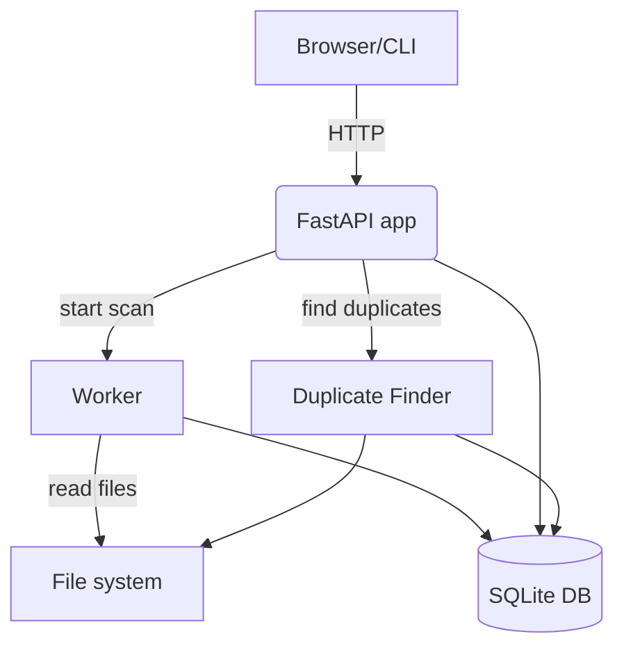

# SongDuplicateCheckerV2

SongDuplicateCheckerV2 is a FastAPI service that scans a music library and highlights possible duplicates. It combines audio fingerprinting with simple heuristics to spot files that look alike so you can decide what to keep.

## Architecture



* **API** – endpoints in `sdc.api` expose scan and duplicate operations.
* **Worker** – background thread in `sdc.worker` scans directories and records progress in SQLite.
* **Duplicate Finder** – logic in `duplicate_finder.py` calculates similarity from stored tracks.

## Usage

1. Install dependencies:
   ```bash
   pip install -r requirements.txt
   ```
2. Scan a directory and populate the database:
   ```bash
   python sdc.py scan /path/to/music
   ```
3. List detected duplicates on the command line:
   ```bash
   python sdc.py duplicates
   ```
4. Run the web service for a browser UI:
   ```bash
   uvicorn sdc.api:app --reload
   ```
   Then visit [http://localhost:8000/scan](http://localhost:8000/scan) to start a scan and [http://localhost:8000/duplicates_table](http://localhost:8000/duplicates_table) to review matches.

